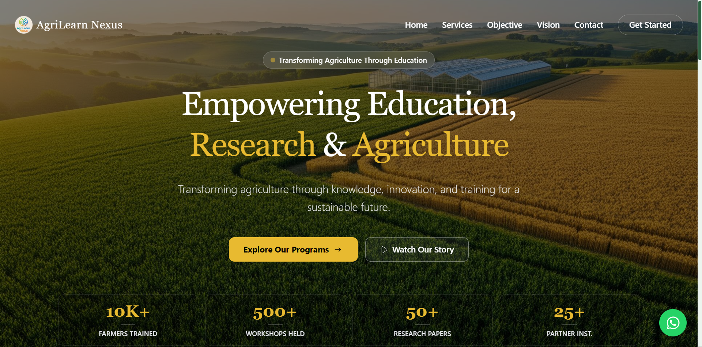

# AgriLearn Nexus



> **Transforming Agriculture Through Education, Research, and Innovation.**

[](https://react.dev/)
[](https://vitejs.dev/)
[](https://tailwindcss.com/)
[]()

---

## 📖 About Us

**AgriLearn Nexus** is a premier platform dedicated to bridging the gap between scientific agricultural research and practical farming applications. We empower the agricultural community—farmers, researchers, and students—by providing specialized training, facilitating research collaborations, and organizing high-impact conferences.

Our mission is to build a **sustainable future** for farming communities through knowledge dissemination and technological adoption.

---

## 🚀 Key Features

* **Responsive Modern UI**: Built with a mobile-first approach using Tailwind CSS v4.
* **Interactive Services Showcase**: Detailed catalog of our offerings including Conferences, Workshops, and FDPs.
* **Dynamic Navigation**: Smart sticky navbar that adapts on scroll for better readability.
* **Instant Connectivity**: Integrated floating WhatsApp support for real-time community engagement.
* **Glassmorphism Aesthetics**: Premium UI design with frosted glass effects and smooth animations.

---

## 🛠️ Tech Stack

This project is engineered using the latest modern web technologies:

* **Framework**: [React 19](https://react.dev/)
* **Build Tool**: [Vite](https://vitejs.dev/) (Fast HMR & Build)
* **Styling**: [Tailwind CSS v4](https://tailwindcss.com/)
* **Routing**: [React Router DOM](https://reactrouter.com/)
* **Icons**: [Lucide React](https://lucide.dev/) & [React Icons](https://react-icons.github.io/react-icons/)
* **Linting**: ESLint (Flat Config)

---

## ⚡ Getting Started

Follow these steps to set up the project locally on your machine.

### Prerequisites

* Node.js (v18 or higher recommended)
* npm or yarn

### Installation

1.  **Clone the repository**
    ```bash
    git clone [https://github.com/your-username/agrilearn-nexus.git](https://github.com/your-username/agrilearn-nexus.git)
    cd agrilearn-nexus
    ```

2.  **Install dependencies**
    ```bash
    npm install
    ```

3.  **Run the development server**
    ```bash
    npm run dev
    ```

4.  **Build for production**
    ```bash
    npm run build
    ```

---

## 📂 Project Structure

```text
src/
├── assets/            # Static assets (Logos, Backgrounds)
├── components/        # Reusable UI Components
│   ├── hero/          # Hero Section with animated stats
│   ├── nav/           # Responsive Navbar
│   ├── services/      # Service Cards & Grid
│   ├── vision/        # Company Vision & Mission
│   ├── footer/        # Contact & Social Links
│   └── ...
├── App.jsx            # Main Application Layout
└── main.jsx           # Entry Point

```

---

## 🌟 Our Services

AgriLearn Nexus specializes in:

* **🎓 Trainings**: Skill-development programs for modern farming.
* **🎤 Conferences**: Gatherings for researchers and industry leaders.
* **🚜 Agri Fair & Expo**: Exhibitions for the latest agri-tech machinery.
* **📝 Research Support**: Assistance for agricultural research papers.
* **🏫 FDP Programs**: Faculty Development Programs for academic staff.

---

## 📬 Contact Us

We are based in **Begusarai, India**, and open to collaborations.

* **Email**: [support@agrilearnnexus.com](mailto:support@agrilearnnexus.com)
* **Phone**: +91 7488468326
* **Address**: Tilak Nagar Road, Near Manoupchar Kendra, Begusarai, 851101

---

<p align="center">
© 2026 AgriLearn Nexus. All rights reserved.
</p>
